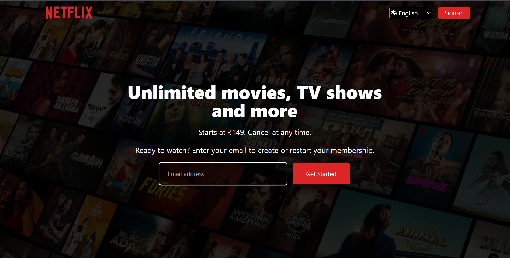
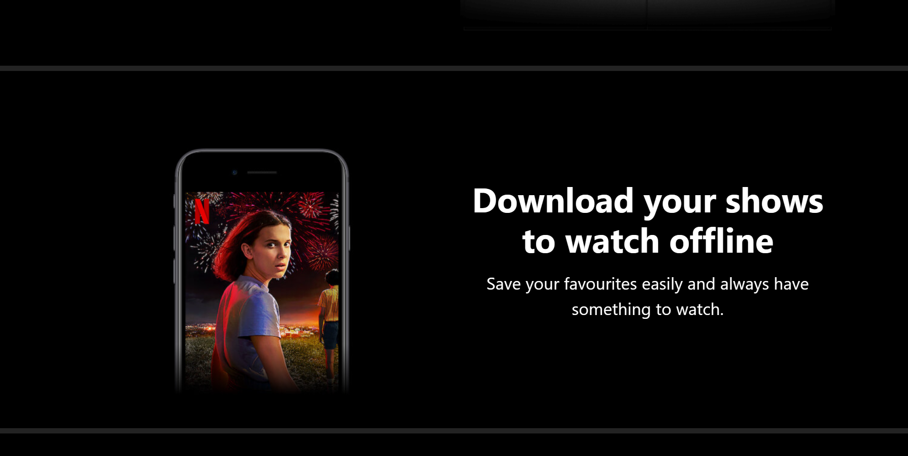
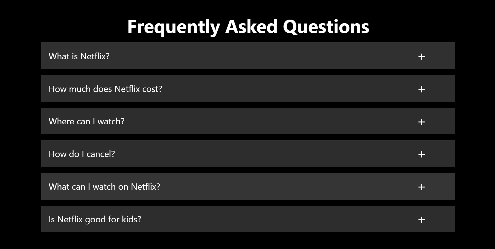

# Netflix Clone

A simple Netflix clone built using **HTML**, **CSS**, and **Tailwind CSS** to practice frontend development and UI design.

---

## Features
- Responsive design using **Tailwind CSS**.
- Clean and simple Netflix-inspired UI.
- Mobile-friendly interface.

---

## Tech Stack
- **HTML**: Structure of the page.
- **Tailwind CSS**: For styling and responsiveness.

---

## Installation
- Clone the repository:
   ```bash
   git clone https://github.com/jaykumar2526/Netflix-clone.git

##Screenshort





